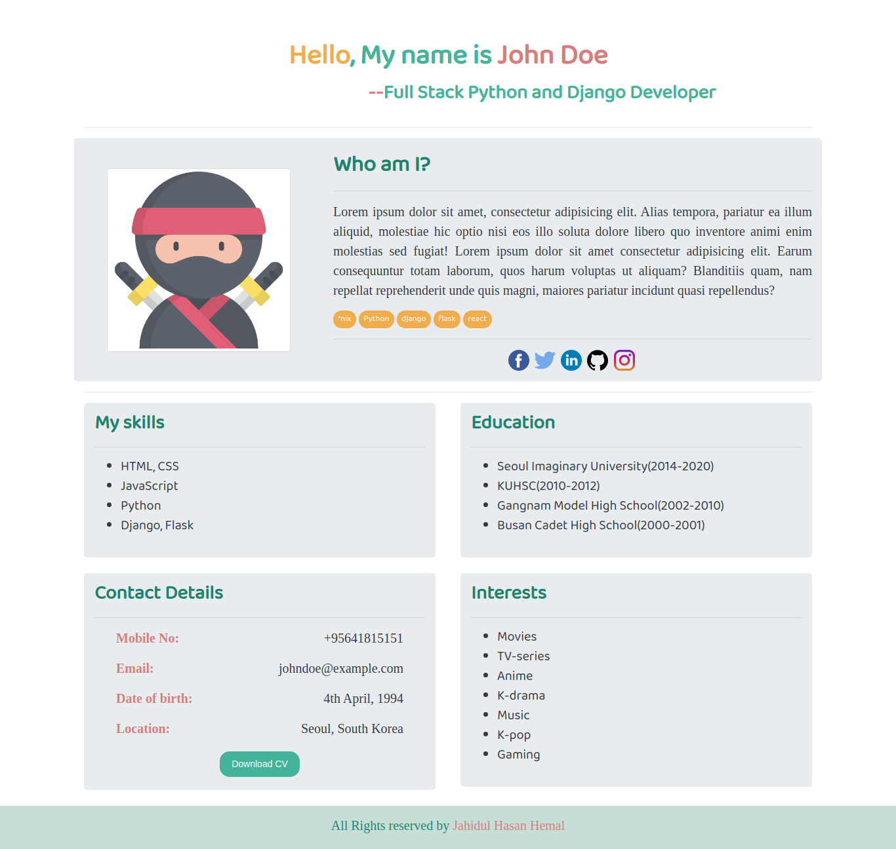

# A simple personal website template.

## How To Setup On Linux
1. Clone This Project `git clone https://github.com/jhhemal/wordpractice.git`
2. Go to Project Directory `cd wordpractice`
3. Done. You can now use, edit the source code.

## Simple Demo
Try demo: `[https://jhhemal.github.io/simple-portfolio/]`
